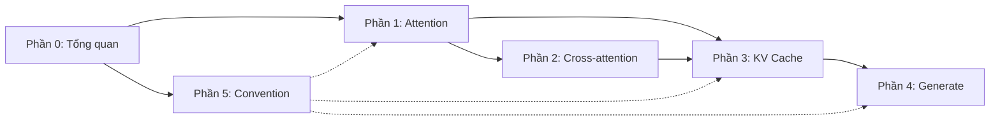

# Roadmap đọc các phần

Bạn đã có bản đồ thư viện và hiểu AutoClass. Chương cuối Phần 0 vẽ ra đường đi cho năm phần còn lại: phần nào dựa trên phần nào, vào lúc nào nên rẽ ngang để đọc file source.

## Dependency giữa các phần

Đường liền nét là dependency cứng (đọc phần trước trước). Đường đứt nét là dependency mềm (đọc trước thì hiểu rõ hơn, nhưng vẫn đọc được nếu skip).

## Khuyến nghị thứ tự

**Lộ trình tiêu chuẩn**:

Phần 0 -> Phần 1 -> Phần 3 -> Phần 4 -> Phần 5 -> Phần 2

Lý do: Phần 1 (attention) là nền cho mọi thứ. Phần 3 (KV cache) dùng nhiều khái niệm Phần 1. Phần 4 (generate) bao trùm tất cả. Phần 5 (convention) là tổng kết, đọc cuối để hệ thống hóa. Phần 2 (cross-attention) là đặc thù, có thể đọc cuối nếu bạn quan tâm encoder-decoder (T5, Whisper, NMT).

**Lộ trình nhanh** (chỉ quan tâm decoder-only LLM như Llama):

Phần 0 -> Phần 1 -> Phần 3 -> Phần 4. Skip Phần 2 và Phần 5 chi tiết, đọc lướt khi cần.

**Lộ trình debug**:

Bạn đang debug một bug cụ thể trong production. Đi thẳng vào phần liên quan:

- Output sai số token / loss NaN: Phần 1 (attention dispatch, mask) hoặc Phần 4 (logits processors).
- Memory tăng theo thời gian: Phần 3 (cache lifecycle).
- Generate chậm: Phần 4 (sampling loop, compile, cache implementation).
- Lỗi `from_pretrained`: Phần 5 (loading flow).
- Cross-attention không hoạt động: Phần 2.

## File nên mở khi đọc từng phần

| Phần | File source mở song song |
|------|------------------------------|
| Phần 1 | `models/llama/modeling_llama.py`, `integrations/sdpa_attention.py`, `integrations/flash_attention.py`, `modeling_utils.py` (section `AttentionInterface`) |
| Phần 2 | `models/t5/modeling_t5.py`, `cache_utils.py` (class `EncoderDecoderCache`) |
| Phần 3 | `cache_utils.py` (đọc toàn bộ) |
| Phần 4 | `generation/utils.py`, `generation/configuration_utils.py`, `generation/logits_process.py`, `generation/stopping_criteria.py` |
| Phần 5 | `modeling_utils.py`, `configuration_utils.py`, `models/auto/auto_factory.py`, `modeling_layers.py` |

## Cách dùng chuỗi này

Có hai cách. **Cách thứ nhất**: đọc tuyến tính từ Phần 1 đến Phần 5, mỗi phần đọc xong mở source xác nhận. Cách này dài nhưng vững.

**Cách thứ hai**: đọc Phần 0 và chương `01-overview` của mỗi phần để có nền. Sau đó dùng các chương chi tiết như reference khi gặp câu hỏi cụ thể. Cách này nhanh nhưng chỉ hiệu quả nếu bạn đã có background.

Khuyến nghị người mới: cách thứ nhất. Người đã có kinh nghiệm: cách thứ hai.

## Khi nào dừng đọc

Chuỗi này không nhằm thay thế việc đọc source. Nó **dẫn đường** vào source. Sau khi đọc một phần, mục tiêu là bạn có thể tự đọc file `modeling_<model>.py` của một model mới và hiểu trong vòng 30 phút. Nếu đạt được điều đó, bạn không cần đọc thêm về model đó từ chuỗi này.

Khi bạn thấy chuỗi này không còn cung cấp insight mới (mọi thứ chuỗi nói bạn đã biết trước khi đọc), đó là dấu hiệu bạn đã master cấp độ "đọc thư viện". Lúc đó bạn có thể chuyển sang viết thư viện của riêng mình, hoặc đóng góp vào HuggingFace.

## Cảnh báo về version

API của thư viện thay đổi giữa các version. Chuỗi này dựa trên version gần đây nhất tại thời điểm biên soạn. Các thay đổi chính giữa version:

- v4.30 trở đi: `attn_implementation` từ string config, không phải kwarg.
- v4.45 trở đi: `AttentionInterface` thay vì decorator @register_attention_forward.
- v4.50 trở đi: `Cache` mới với `CacheLayerMixin`, deprecated `LegacyCache` tuple-based.
- v5.0 trở đi: bỏ TF/Flax backend, chỉ PyTorch.

Khi đọc, đối chiếu version. Nếu file source của bạn khác chuỗi, không phải lỗi của bạn, là API đã thay đổi.

Sẵn sàng, Phần 1 chờ.
