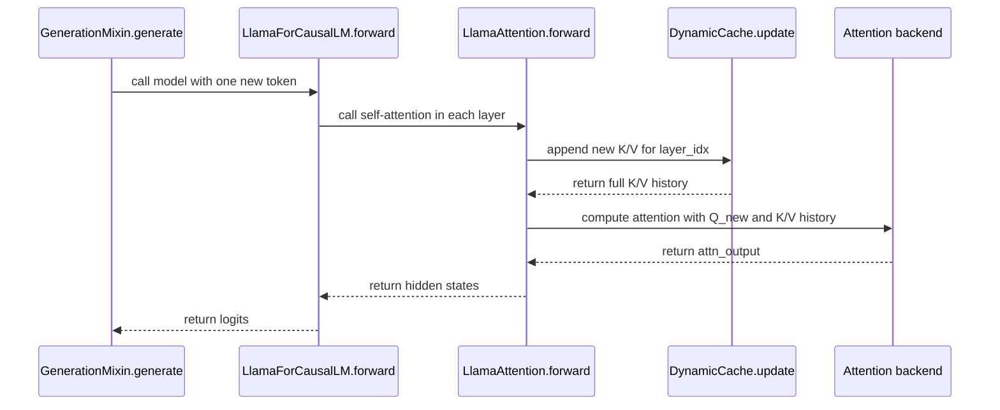
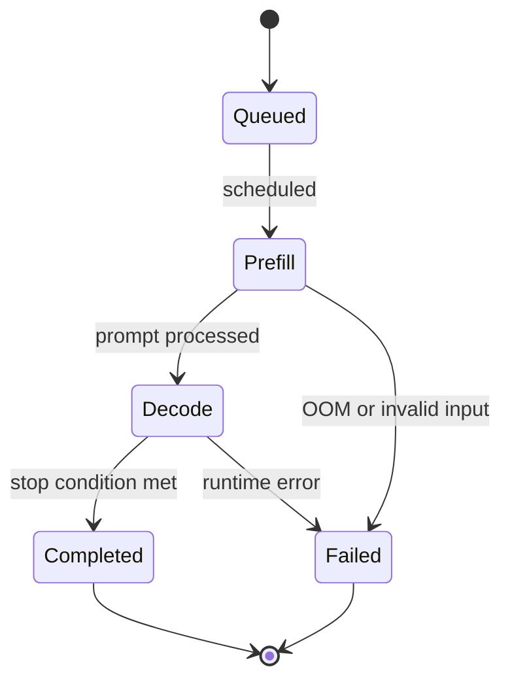

# Cách đọc diagram và chart trong software design

Một người mới đọc tài liệu kỹ thuật thường gặp một trang đầy box, mũi tên, màu sắc, layer, icon cloud, queue, database, service, model, cache. Cảm giác tự nhiên là phải hiểu toàn bộ hình ngay lập tức. Cách đọc đó gần như luôn sai.

Diagram không phải là một bức tranh để nhìn một lần rồi hiểu hết. Diagram là một lát cắt có chủ đích của hệ thống. Mỗi lát cắt trả lời một câu hỏi hẹp: dữ liệu đi đâu, hàm nào gọi hàm nào, module nào phụ thuộc module nào, request đi qua service nào, state chuyển ra sao, hoặc bottleneck nằm ở đâu. Nếu chưa biết diagram đang trả lời câu hỏi gì, người đọc sẽ bị kéo theo màu sắc và icon, rồi mất phương hướng.

Bài này đưa ra một phương pháp đọc diagram có hệ thống. Nó cũng phân loại các loại diagram và chart phổ biến trong software design, để khi gặp một sơ đồ trên mạng, bạn biết nên đọc nó bằng con mắt nào.

## Quy tắc nền: hỏi diagram đang trả lời câu hỏi gì

Trước khi nhìn vào node và edge, hãy hỏi một câu đơn giản:

> Diagram này đang giúp ta trả lời câu hỏi nào?

Nếu câu hỏi là "request đi qua những component nào", ta cần context, container hoặc component diagram. Nếu câu hỏi là "object nào gọi object nào theo thời gian", ta cần sequence diagram. Nếu câu hỏi là "tensor đổi shape qua các bước nào", ta cần dataflow diagram. Nếu câu hỏi là "object có những trạng thái hợp lệ nào", ta cần state machine. Nếu câu hỏi là "service nào deploy ở node nào", ta cần deployment diagram.

Sai lầm phổ biến là dùng một diagram cho mọi câu hỏi. Một architecture diagram cao tầng không chứng minh được tensor shape. Một sequence diagram không thay được dataflow diagram. Một dependency graph không cho biết latency runtime. Một heatmap attention không cho biết code path nào tạo ra mask.

## Giao thức đọc một diagram bất kỳ

Khi gặp một diagram mới, đọc theo 7 bước sau.

### Bước 1: đọc title và caption

Title thường nói diagram đang mô tả tầng nào: system, container, component, code path, dataflow, deployment, hoặc runtime behavior. Nếu title mơ hồ kiểu "Architecture overview", hãy tự bổ sung câu hỏi cụ thể trước khi đọc tiếp.

Ví dụ title tốt:

- `Generate step: sequence from GenerationMixin to Cache.update`
- `KV cache dataflow during one-token decode`
- `Container view of model serving system`
- `State machine of request lifecycle`

Ví dụ title yếu:

- `System architecture`
- `Transformer diagram`
- `Pipeline`

Title yếu không làm diagram vô dụng, nhưng buộc người đọc phải suy luận nhiều hơn.

### Bước 2: xác định node type

Một node có thể là rất nhiều thứ khác nhau:

- Class hoặc function, ví dụ `LlamaAttention.forward`.
- Tensor, ví dụ `query_states` shape `(B, H, T, D)`.
- Process hoặc service, ví dụ `API server`, `worker`, `scheduler`.
- Storage, ví dụ database, object store, cache.
- Queue hoặc stream, ví dụ Kafka topic.
- User, external system, hardware device.
- State, ví dụ `Queued`, `Running`, `Completed`.

Đừng đọc mũi tên trước khi biết node là gì. Nếu node type không rõ, cùng một mũi tên có thể bị hiểu sai: call, dependency, data movement, ownership, deployment relation, hoặc time order.

### Bước 3: xác định edge meaning

Edge là phần dễ gây nhầm nhất. Một mũi tên có thể nghĩa là:

- Function A gọi function B.
- Service A gửi request tới service B.
- Tensor đi từ operation A sang operation B.
- Module A import module B.
- Component A phụ thuộc vào component B lúc build.
- Event A xảy ra trước event B.
- State A chuyển sang state B.
- Data được replicate từ store A sang store B.

Nếu diagram không ghi legend, hãy đọc tên cạnh hoặc đọc đoạn văn ngay trước và sau diagram. Một diagram tốt luôn nói rõ edge biểu diễn gì.

### Bước 4: tìm entry point và exit point

Mọi flow đều có điểm bắt đầu và kết thúc. Với transformers internals, entry point có thể là `generate()`, `model.forward()`, `LlamaAttention.forward()`, hoặc `Cache.update()`. Với software system, entry point có thể là HTTP request, cron job, message từ queue, hoặc user action.

Khi đã có entry và exit, diagram không còn là một đám node rời rạc. Nó trở thành một đường đi có thể trace.

### Bước 5: bỏ qua styling trước

Màu sắc, icon, cloud vendor logo, border style, grouping box đều có thể hữu ích, nhưng chỉ đọc sau khi hiểu semantics chính. Nếu đọc styling quá sớm, bạn sẽ bị kéo vào chi tiết trình bày thay vì câu hỏi kỹ thuật.

Thứ tự nên là:

1. Node type.
2. Edge meaning.
3. Entry và exit.
4. Critical path.
5. Grouping và styling.

### Bước 6: trace một path cụ thể

Đừng cố đọc toàn bộ diagram cùng lúc. Chọn một đơn vị cụ thể và đi hết đường của nó:

- Một request.
- Một token.
- Một tensor.
- Một cache entry.
- Một event.
- Một function call.
- Một user action.

Ví dụ khi đọc KV cache, hãy chọn token mới ở decode step `t`. Trace từ `input_ids`, qua embedding, qua attention, vào `past_key_values.update`, rồi quay lại attention backend. Sau một path cụ thể, các nhánh phụ dễ hiểu hơn nhiều.

### Bước 7: rút ra invariant

Đọc diagram xong, bạn phải nói được vài invariant kiểm chứng được. Nếu không có invariant, nghĩa là bạn mới nhìn hình chứ chưa hiểu hệ thống.

Ví dụ invariant tốt:

- Trong decode, Q chỉ có sequence length bằng 1, còn K/V tăng theo thời gian.
- `DynamicCache.update` append K/V mới vào layer tương ứng.
- Cross-attention cache của encoder chỉ cần tính một lần cho mỗi input encoder.
- `GenerationMixin.generate` điều phối vòng lặp, còn model-specific attention nằm trong `modeling_*.py`.

Invariant là cầu nối giữa diagram và code.

## Bảng chọn diagram theo câu hỏi

| Câu hỏi cần trả lời | Diagram hoặc chart phù hợp | Node thường là gì | Edge thường là gì | Sai lầm phổ biến |
|---|---|---|---|---|
| Hệ thống giao tiếp với actor ngoài như thế nào? | System context diagram | User, external system, system chính | Interaction hoặc API boundary | Nhồi cả database và class vào context view |
| Hệ thống gồm những runtime container nào? | Container diagram | Web app, API, worker, database, queue | Network call, message, read/write | Biến container diagram thành deployment diagram |
| Component bên trong một service chia thế nào? | Component diagram | Module, package, subsystem, task head | Dependency hoặc call relation | Không nói rõ edge là dependency hay call |
| Request đi qua các object theo thời gian ra sao? | Sequence diagram | Object, class, service, function | Message theo thứ tự thời gian | Dùng sequence diagram để mô tả data shape |
| Tensor hoặc data đổi qua các bước nào? | Dataflow diagram | Tensor, operation, stage, storage | Data movement hoặc transformation | Bỏ shape nên diagram chỉ còn hình minh họa |
| Control flow rẽ nhánh thế nào? | Flowchart hoặc activity diagram | Step, decision, action | Next step hoặc branch | Dùng flowchart cho architecture cao tầng |
| Object có state nào và transition nào hợp lệ? | State machine | State | Transition có điều kiện | Vẽ state như step tuần tự, không ghi event chuyển state |
| Module nào phụ thuộc module nào? | Dependency graph | Package, module, file, service | Import, build dependency, runtime dependency | Nhầm dependency graph với call graph |
| Function nào gọi function nào? | Call graph | Function hoặc method | Function call | Tưởng call graph chứng minh data correctness |
| Data model quan hệ ra sao? | ERD hoặc schema diagram | Entity, table, field | Relation, foreign key | Dùng ERD để mô tả runtime flow |
| Class/interface quan hệ ra sao? | Class diagram | Class, interface, method | Inheritance, composition, implementation | Vẽ quá nhiều method không liên quan |
| Service deploy lên hạ tầng nào? | Deployment diagram | Node, pod, container, region, device | Hosted on, network path | Trộn logical component với physical node |
| Event trong domain xảy ra theo thứ tự nào? | Event storming hoặc event flow | Command, event, aggregate, policy | Causality | Thiếu actor và command gây mất ngữ cảnh |
| Business process qua nhiều role ra sao? | BPMN hoặc swimlane | Role, task, gateway, event | Handoff hoặc sequence | Dùng BPMN cho code-level behavior |
| Hoạt động diễn ra theo pha thời gian nào? | Timeline chart | Phase, event, milestone | Time order | Không ghi scale thời gian |
| Metric thay đổi theo thời gian ra sao? | Line chart | Time series point | Time progression | Dùng line chart cho category không có thứ tự |
| So sánh nhiều category ra sao? | Bar chart | Category | Value comparison | Dùng quá nhiều category làm mất insight |
| Hai biến liên hệ thế nào? | Scatter plot | Observation | Position in 2D | Suy luận causality khi chỉ có correlation |
| Mật độ hoặc pattern ma trận ra sao? | Heatmap hoặc matrix diagram | Cell trong matrix | Intensity hoặc relation | Không ghi scale màu |
| Dòng chảy khối lượng qua stage ra sao? | Sankey diagram | Stage | Quantity flow | Dùng Sankey khi không có conservation logic |
| CPU/GPU time bị tiêu ở đâu? | Flame graph hoặc profiler chart | Stack frame | Call stack nesting | Đọc width như time order thay vì aggregate cost |

Bảng này không phải để memorize tên diagram. Mục tiêu là tạo phản xạ: bắt đầu từ câu hỏi, rồi mới chọn hình.

## Các loại diagram quan trọng trong software design

### System context diagram

Context diagram trả lời câu hỏi: hệ thống của ta nằm giữa những actor và system nào?

Đây là tầng ngoài cùng. Node chính là system đang thiết kế. Node xung quanh là user, external API, identity provider, payment provider, model registry, object storage, monitoring system. Edge thường là interaction hoặc data exchange ở mức rất cao.

Một context diagram tốt không giải thích class, table, hoặc function. Nó chỉ nói boundary. Nếu context diagram có quá nhiều chi tiết nội bộ, người đọc mất khả năng trả lời câu hỏi quan trọng nhất: hệ thống này chịu trách nhiệm phần nào, phần nào thuộc bên ngoài.

### Container diagram

Container diagram trả lời câu hỏi: hệ thống chạy bằng những runtime unit nào?

Trong software architecture, container không nhất thiết là Docker container. Nó có nghĩa rộng hơn: web frontend, API server, worker, database, queue, cache, batch job, model serving process. Đây là sơ đồ hữu ích khi đọc một system production.

Ví dụ một hệ model serving có thể có:

- API gateway.
- Request router.
- Model server.
- Scheduler.
- KV cache manager.
- Metrics exporter.
- Object store chứa weight.

Container diagram cho biết runtime boundary và communication. Nó không thay thế deployment diagram, vì deployment diagram mới trả lời container đó chạy ở node, region, pod hoặc device nào.

### Component diagram

Component diagram đi vào bên trong một container hoặc service. Node thường là module, package, subsystem hoặc class lớn. Nó trả lời câu hỏi: code được chia thành những boundary logic nào?

Trong transformers, có thể dùng component diagram để đọc một modeling file:

```text
Configuration -> PreTrainedModel base -> Body model -> Task heads
                         |
                         v
                  Utility functions
```

Điểm cần chú ý là component boundary không phải file boundary tuyệt đối. Một file có thể chứa nhiều component logic. Ngược lại, một component có thể trải qua nhiều file nếu library design chọn tách abstraction.

### Sequence diagram

Sequence diagram trả lời câu hỏi: ai gọi ai, theo thứ tự thời gian nào?

Nó rất phù hợp để đọc runtime behavior. Ví dụ một step decode có thể được đọc như sau:



Khi đọc sequence diagram, đừng hỏi tensor shape trước. Hãy hỏi thứ tự call trước. Sau đó mới gắn shape vào từng message quan trọng.

### Dataflow diagram

Dataflow diagram trả lời câu hỏi: data đi qua các transformation nào?

Nó đặc biệt quan trọng với ML systems, vì correctness thường nằm ở shape, dtype, device, mask, cache position và batch dimension. Với transformers, dataflow diagram hữu ích hơn sequence diagram khi câu hỏi là "tensor đổi từ shape nào sang shape nào".

Ví dụ một phần attention dataflow:

```mermaid
flowchart LR
  H[hidden_states<br/>(B, T, hidden)] --> Q[q_proj<br/>(B, Hq, T, Dh)]
  H --> K[k_proj<br/>(B, Hkv, T, Dh)]
  H --> V[v_proj<br/>(B, Hkv, T, Dh)]
  Q --> R[RoPE]
  K --> R
  R --> A[attention backend]
  V --> A
  A --> O[o_proj<br/>(B, T, hidden)]
```

Ở đây node là tensor hoặc operation. Edge là data transformation. Nếu bỏ shape, diagram mất phần lớn giá trị kỹ thuật.

### Dependency graph

Dependency graph trả lời câu hỏi: module nào phụ thuộc module nào?

Dependency graph không phải sequence diagram. Nếu module A import module B, không có nghĩa A luôn gọi B ở runtime trong mọi path. Nó chỉ cho biết coupling ở mức build hoặc code organization.

Dependency graph tốt để phát hiện:

- Cycle giữa module.
- Layer violation.
- Module cấp thấp phụ thuộc ngược lên module cấp cao.
- Utility package bị biến thành nơi chứa mọi thứ.

### Call graph

Call graph trả lời câu hỏi: function nào có thể gọi function nào?

Call graph gần sequence diagram, nhưng không giống hẳn. Sequence diagram thường mô tả một scenario cụ thể. Call graph mô tả quan hệ call rộng hơn, có thể gồm nhiều nhánh và nhiều path.

Khi debug codebase lớn, call graph giúp tìm entry point và fan-out. Nhưng nó thường không cho biết data shape, branch condition hoặc object state. Vì vậy sau khi dùng call graph để tìm đường, vẫn cần đọc code ở các edge quan trọng.

### State machine

State machine trả lời câu hỏi: object hoặc request có những state hợp lệ nào, và event nào làm nó chuyển state?

Ví dụ request serving có thể có các state:



State machine hữu ích khi bug liên quan lifecycle: cache chưa init, request bị cancel, stream bị đóng, batch bị evict, job retry nhiều lần. Nếu diagram state không ghi event hoặc condition, nó chỉ là flowchart trá hình.

### Deployment diagram

Deployment diagram trả lời câu hỏi: phần mềm chạy ở đâu?

Node là physical hoặc infrastructure unit: laptop, GPU node, Kubernetes pod, region, edge device, VM, container runtime. Edge là network path hoặc placement relation.

Deployment diagram quan trọng khi bàn về latency, bandwidth, cost, reliability, data residency, GPU memory và failure domain. Nó không nên chứa quá nhiều class hoặc function. Nếu thấy `LlamaAttention.forward` trong deployment diagram, nhiều khả năng diagram đang trộn tầng.

### ERD và schema diagram

ERD trả lời câu hỏi: data entity quan hệ với nhau như thế nào?

Trong hệ ML production, ERD có thể mô tả model registry, experiment, dataset version, artifact, evaluation run. Trong transformers internals, ERD ít dùng hơn, nhưng schema diagram vẫn hữu ích khi mô tả config object, tokenizer files, generation config và model card metadata.

Sai lầm phổ biến là dùng ERD để giải thích runtime behavior. Entity relation nói data được lưu thế nào, không nói request chạy thế nào.

### Class diagram

Class diagram trả lời câu hỏi: class, interface, inheritance và composition liên hệ thế nào?

Nó hữu ích khi đọc hierarchy như `PreTrainedModel`, `GenerationMixin`, task head class, cache abstraction. Tuy nhiên class diagram rất dễ bị quá tải nếu vẽ mọi method. Chỉ nên vẽ method hoặc field liên quan trực tiếp tới câu hỏi.

Ví dụ với cache, một class diagram nhỏ chỉ cần nói:

- `Cache` là abstraction.
- `DynamicCache` chứa list layer.
- `DynamicLayer` giữ `keys` và `values`.
- `update` là method quan trọng.

Phần còn lại đọc trong source.

### Event storming và event flow

Event flow trả lời câu hỏi: trong domain, event nào xảy ra sau command nào?

Loại diagram này thường gặp trong distributed system và event-driven architecture. Node có thể là command, event, policy, aggregate, external system. Nó giúp tách domain behavior khỏi implementation detail.

Trong ML platform, event flow có thể mô tả:

- `Dataset uploaded`.
- `Training job requested`.
- `Model artifact created`.
- `Evaluation completed`.
- `Model promoted`.
- `Deployment started`.

Nếu thiếu actor và command, event flow dễ biến thành danh sách event không có nguyên nhân.

### BPMN, activity diagram và swimlane

BPMN và swimlane trả lời câu hỏi: process đi qua những role nào, có decision point nào, và handoff diễn ra ở đâu?

Chúng phù hợp với quy trình nghiệp vụ hoặc operational workflow: model approval, incident response, data labeling, compliance review. Chúng không phải công cụ tốt để mô tả tensor flow hoặc call stack.

Swimlane đặc biệt hữu ích khi cùng một flow đi qua nhiều vai trò: data scientist, ML engineer, platform engineer, reviewer, CI/CD system.

### Timeline chart

Timeline chart trả lời câu hỏi: sự kiện hoặc phase diễn ra theo thời gian nào?

Trong transformers inference, timeline có thể dùng để tách prefill và decode. Trong distributed systems, timeline giúp phân tích retry, timeout, queue delay, batch window, cold start.

Timeline khác sequence diagram ở chỗ nó nhấn mạnh thời lượng và overlap. Sequence diagram nhấn mạnh message order.

### Heatmap và matrix diagram

Heatmap trả lời câu hỏi: pattern trong ma trận là gì?

Attention mask, attention weight, routing matrix, confusion matrix, latency matrix đều có thể dùng heatmap. Nhưng heatmap chỉ có ý nghĩa khi scale màu rõ ràng. Nếu không biết màu đậm nghĩa là xác suất, latency, count, hoặc binary mask, người đọc sẽ diễn giải sai.

Với attention, heatmap rất hấp dẫn về mặt thị giác, nhưng không thay thế được code path tạo mask. Khi thấy một attention heatmap, hãy hỏi:

- Matrix có trục nào?
- Cell biểu diễn weight, mask hay score trước softmax?
- Đây là một head, trung bình nhiều head, hay tổng hợp nhiều layer?
- Giá trị đã normalize chưa?

### Flame graph và profiler chart

Profiler chart trả lời câu hỏi: thời gian hoặc tài nguyên bị tiêu ở đâu?

Flame graph đặc biệt hữu ích khi tối ưu inference. Width thường biểu diễn tổng cost, không phải thứ tự thời gian. Stack frame nằm trên nhau biểu diễn call stack. Người mới hay đọc nhầm flame graph như timeline. Đó là sai lầm nghiêm trọng.

Khi đọc profiler chart, cần biết workload cụ thể: model nào, batch size, sequence length, hardware, backend attention, dtype, cache strategy. Không có context đó, chart chỉ là hình minh họa.

## Phân biệt các cặp dễ nhầm

### Sequence diagram và dataflow diagram

Sequence diagram hỏi: ai gọi ai theo thời gian?

Dataflow diagram hỏi: dữ liệu biến đổi qua những bước nào?

Trong `generate`, sequence diagram cho thấy `GenerationMixin` gọi model, model gọi layer, layer gọi attention, attention gọi cache. Dataflow diagram cho thấy `hidden_states` đi qua projection thành Q/K/V, qua RoPE, qua attention backend, rồi qua output projection.

Hai diagram cùng đúng, nhưng trả lời hai câu hỏi khác nhau.

### Dependency graph và call graph

Dependency graph hỏi: module nào phụ thuộc module nào ở mức code organization?

Call graph hỏi: function nào có thể gọi function nào ở runtime?

Một module có thể import module khác nhưng chỉ dùng trong một branch hiếm. Ngược lại, dynamic dispatch có thể làm call graph không hiện rõ trong import graph. Với transformers, `AttentionInterface` là ví dụ tốt: call runtime phụ thuộc `attn_implementation`, không chỉ phụ thuộc import tĩnh.

### Component diagram và deployment diagram

Component diagram hỏi: code chia thành boundary logic nào?

Deployment diagram hỏi: các runtime unit chạy ở đâu?

Một component có thể được deploy trong cùng process với component khác. Một container có thể chứa nhiều component. Nếu trộn hai tầng, người đọc không biết mũi tên là dependency logic hay network call.

### Flowchart và state machine

Flowchart hỏi: bước xử lý tiếp theo là gì?

State machine hỏi: object đang ở state nào, event nào chuyển nó sang state khác?

Nếu bug liên quan object lifecycle, state machine thường rõ hơn flowchart. Nếu bug liên quan branch xử lý, flowchart thường đủ.

## Cách đọc diagram phức tạp trên mạng mà không bị quá tải

Khi gặp một diagram rất lớn, không đọc từ trái sang phải ngay. Hãy giảm nó thành 3 lớp.

### Lớp 1: skeleton

Chỉ tìm 3 đến 7 node chính. Bỏ qua node phụ, label dài và icon. Hỏi:

- System chính là gì?
- Actor ngoài là ai?
- Runtime boundary chính nằm ở đâu?
- Data hoặc request đi theo hướng tổng quát nào?

Nếu không tìm được skeleton, diagram có thể đang thiếu hierarchy.

### Lớp 2: critical path

Chọn path quan trọng nhất. Với inference, path có thể là một request từ API tới model server rồi trả token stream. Với source reading, path có thể là `generate -> model.forward -> attention -> cache.update`.

Chỉ khi critical path rõ, mới đọc branch phụ.

### Lớp 3: edge cases

Sau critical path, thêm edge cases:

- Error path.
- Retry path.
- Fallback backend.
- Cache miss.
- Batch merge hoặc split.
- Timeout.
- Cancel.
- OOM.
- Quantized/offloaded path.

Diagram lớn thường khó vì nó trộn critical path và edge cases cùng lúc. Người đọc nên tách chúng ra trong đầu.

## Cách tự vẽ diagram tốt khi viết tài liệu

Một diagram tốt thường bắt đầu bằng một câu hỏi. Sau đó mới chọn loại hình.

### Checklist trước khi vẽ

- Câu hỏi chính là gì?
- Reader cần biết node là gì?
- Edge biểu diễn quan hệ gì?
- Có cần legend không?
- Entry point và exit point ở đâu?
- Diagram này ở tầng nào: system, container, component, code, data, state, deployment hay metric?
- Có đang trộn nhiều tầng không?
- Có thể bỏ bớt node nào mà vẫn trả lời được câu hỏi không?
- Sau diagram, reader rút ra invariant nào?

Nếu không trả lời được các câu này, hãy viết đoạn giải thích trước. Đừng vẽ chỉ để trang nhìn trực quan hơn.

### Nên dùng progressive disclosure

Thay vì đưa một diagram 40 node ngay lập tức, hãy chia thành 3 phiên bản:

1. Overview rất nhỏ.
2. Critical path có thêm edge quan trọng.
3. Full version có branch và edge cases.

Cách này đặc biệt quan trọng trong giáo trình. Người học không thiếu diagram trên mạng. Họ thiếu phương pháp bóc tách diagram.

### Giới hạn số diagram trong một bài

Một bài tốt thường có 1 đến 3 diagram chính:

- Một diagram overview.
- Một diagram critical path.
- Một diagram pitfall hoặc edge case.

Nếu có nhiều hơn, mỗi diagram phải trả lời câu hỏi khác nhau. Năm diagram cùng mô tả một flow thường không làm bài rõ hơn, chỉ làm người đọc mệt hơn.

## Áp dụng vào chuỗi transformers internals

Trong chuỗi này, diagram nên phục vụ việc đọc source, không thay thế source. Sau mỗi diagram quan trọng, người đọc nên được kéo về một trong bốn thứ:

- File và class thật, ví dụ `models/llama/modeling_llama.py`, `LlamaAttention`.
- Snippet code ngắn chứng minh edge quan trọng.
- Tensor shape trước và sau một operation.
- Invariant có thể kiểm chứng trong code.

Ví dụ khi đọc `docs/03-kv-cache/07-sequence-diagram-update`, sequence diagram giúp hiểu thứ tự call. Nhưng để hiểu đúng KV cache, người đọc vẫn phải kiểm tra invariant: `update` append K/V mới và return full K/V history cho layer đó.

Đây là điểm khác biệt giữa diagram để trang trí và diagram để học kỹ thuật. Diagram để trang trí làm người đọc có cảm giác đã hiểu. Diagram để học kỹ thuật giúp người đọc biết chính xác cần mở file nào, đọc method nào, kiểm chứng shape nào, và nghi ngờ điều gì khi bug xuất hiện.

## Pitfalls

### Pitfall 1: đọc diagram như ảnh minh họa

Nếu chỉ nhìn màu và icon, bạn sẽ nhớ bề mặt nhưng không hiểu semantics. Hãy luôn hỏi node là gì, edge là gì, path chính là gì.

### Pitfall 2: trộn nhiều tầng trong một hình

Một hình vừa có user, API, database, class, function, tensor shape, GPU node và latency chart thường rất khó đọc. Không phải vì người đọc yếu, mà vì diagram đang gộp quá nhiều câu hỏi.

### Pitfall 3: tin diagram hơn code

Diagram trong blog hoặc slide có thể đã giản lược, lỗi version, hoặc bỏ edge case. Với thư viện như transformers, code là source of truth. Diagram là bản đồ đọc code, không phải bằng chứng cuối cùng.

### Pitfall 4: không ghi scale cho chart

Chart không có axis, unit, workload, batch size, sequence length hoặc hardware context rất dễ gây hiểu nhầm. Đặc biệt với latency và memory, thiếu context gần như làm chart mất giá trị kỹ thuật.

### Pitfall 5: dùng diagram theo trend

Không phải mọi thứ đều cần C4, UML, BPMN hoặc Mermaid. Chọn diagram theo câu hỏi. Nếu bảng so sánh rõ hơn, dùng bảng. Nếu pseudocode rõ hơn, dùng pseudocode. Nếu một đoạn prose đủ rõ, không cần diagram.

## Kết luận

Một người đọc kỹ thuật giỏi không cố hiểu toàn bộ diagram trong một lần nhìn. Họ xác định câu hỏi, phân loại node và edge, trace một path cụ thể, rồi rút ra invariant có thể kiểm chứng. Khi đã có phương pháp này, các diagram phức tạp trên mạng không còn là một khối hình ảnh gây áp lực. Chúng trở thành những lát cắt có thể đọc, kiểm tra và đối chiếu với code.
